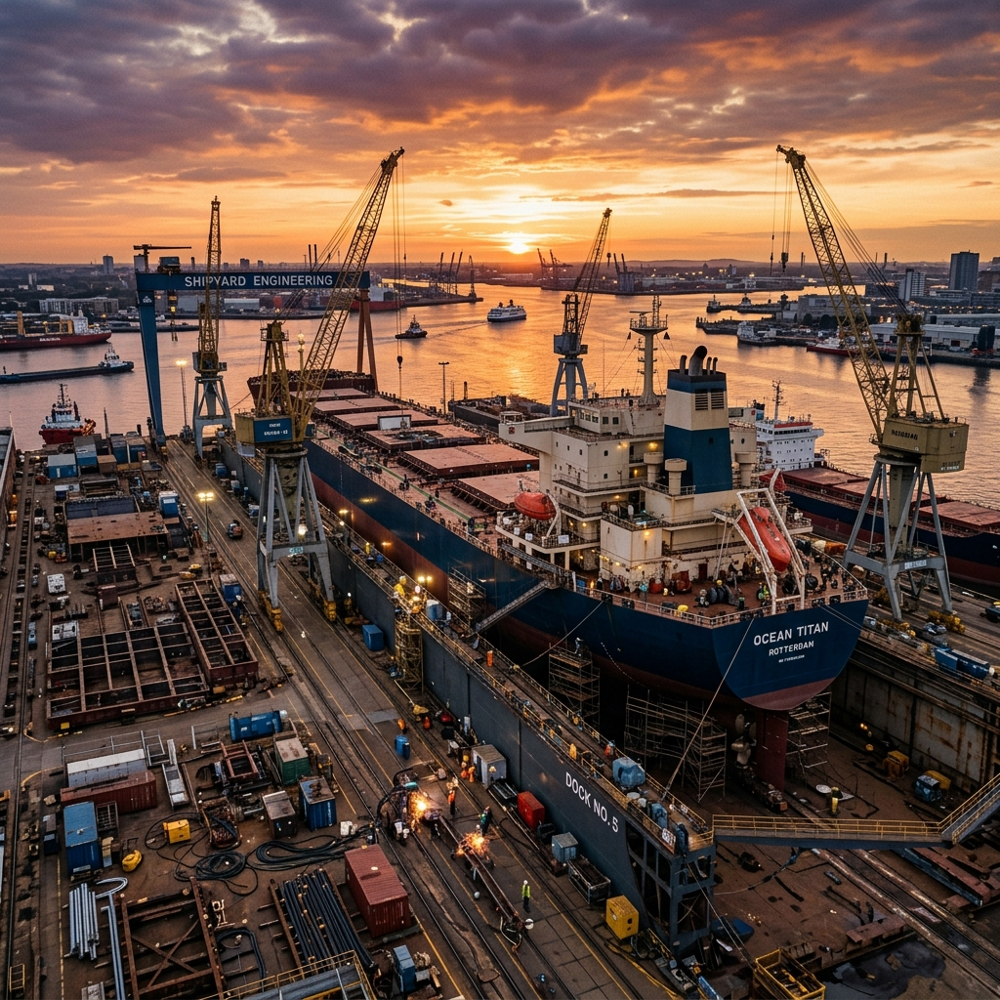
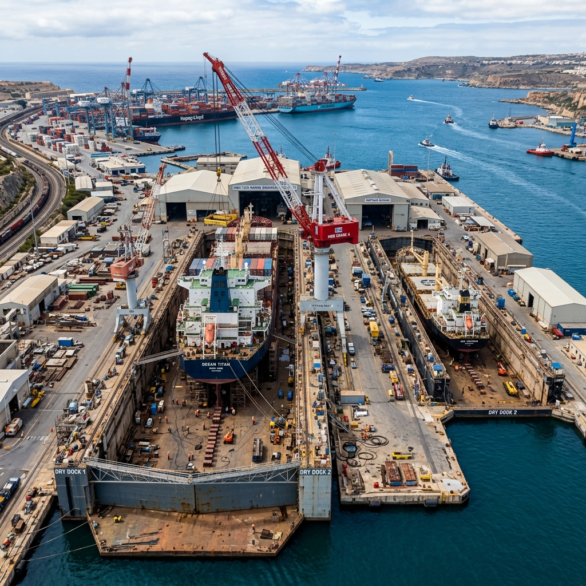
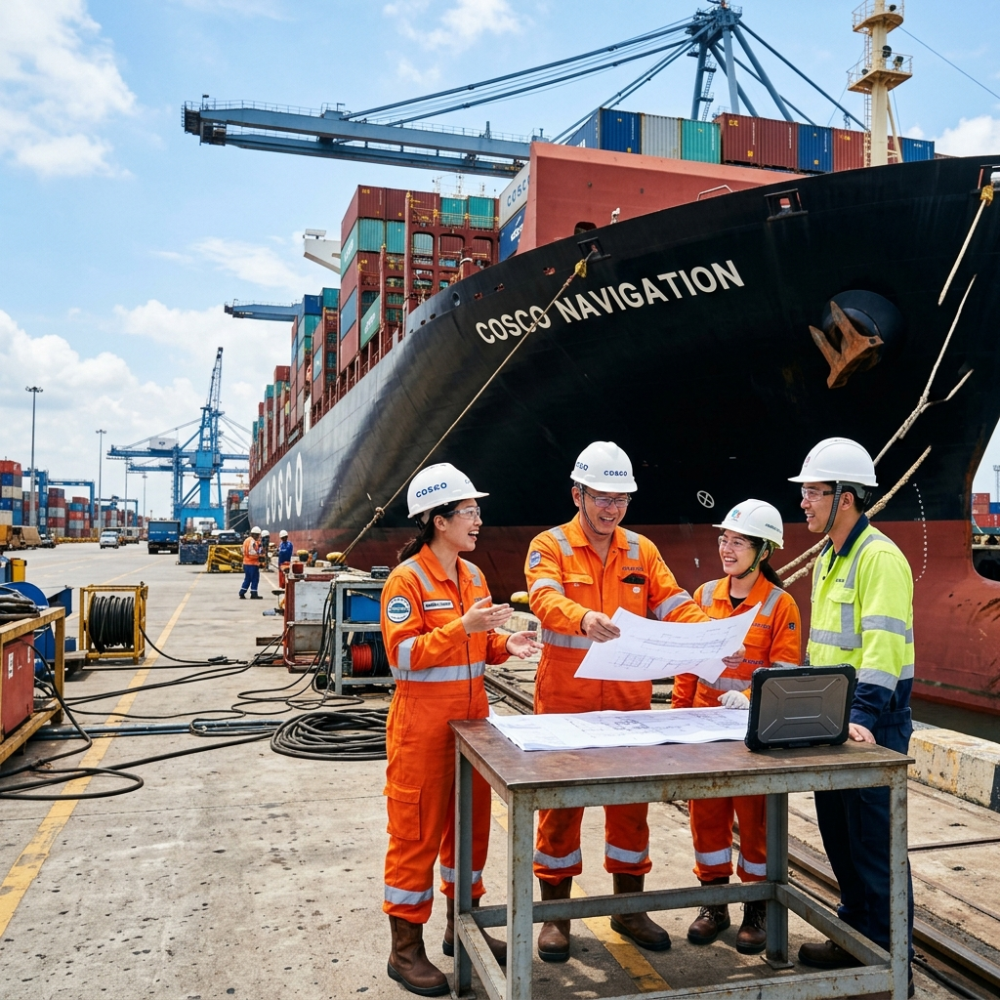
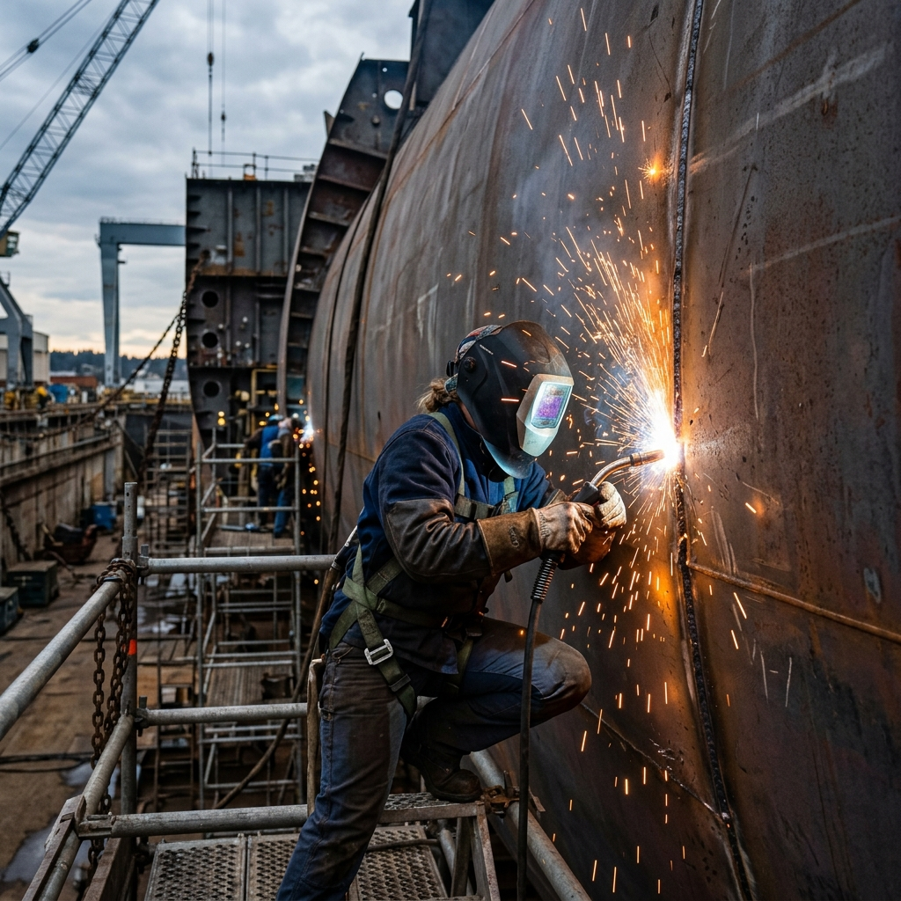

  <h1 style="color: #003d82; font-size: 24px; border-bottom: 2px solid #003d82; padding-bottom: 10px;">启航新程 | 岱山文涛船舶工程官方微信正式上线</h1>
  
岱山文涛船舶工程有限公司

 

> 岱山文涛船舶工程有限公司官方微信公众平台今日正式开通。我们将以此为服务视窗，分享船舶工程案例、展现维修工艺现场，致力于为航运企业及船东提供高效、透明的沟通渠道，与各位行业同仁建立长期的信任合作关系。

 

  

 

### 01 依托舟山优势，铸就专业品质

岱山文涛船舶工程有限公司坐落于浙江省舟山市。作为世界级港口群的核心区域，舟山拥有得天独厚的海洋资源与成熟的船舶修造产业链。

依托这一产业沃土，文涛船舶专注于各类船舶工程、维修及相关技术咨询服务。我们秉持专业、务实的态度，致力于为国内外航运企业提供一站式、高标准、定制化的船舶工程解决方案。

 

  

 

### 02 核心业务矩阵

船舶的高效营运，依赖于精密的工程维护。文涛船舶深知每一次检修对船东的重要意义，目前已全面开展以下核心业务：

* 🔧 **船舶综合维修**：涵盖船体结构修复、轮机设备检修、管系换新等常规与突发维修服务。
* 🏗️ **特种工程外包**：承接高标准的船厂分段制造、甲板机械安装及各类特种船舶工程。
* 💡 **专业技术咨询**：提供船舶工程前期规划、成本核算、现场施工工艺优化等技术支持。

 

  

 

### 03 实力与效率的保障

**✅ 专业技术团队**
公司核心工程师均具备多年大型船厂从业背景，熟悉各大船级社标准，具备独立排查故障与攻克复杂技术难关的能力。

**✅ 严格的质量与安全标准**
践行“质量第一，安全至上”理念。从图纸会审、施工监控到交付检验，实行全流程节点控制，以“零缺陷、零事故”为生产准则。

**✅ 敏捷的响应机制**
依托舟山本地行业资源，建立24小时快速响应机制，确保物料调配与技术人员及时抵达施工现场，缩短船舶坞修与停泊时间。

 

  

 

### 04 结语

在船舶工程领域，文涛船舶将始终坚持“以技术为核心，以服务为导向”。我们不仅是您的工程承包商，更是保障船舶安全航行的可靠岸基后盾。

未来，本公众号将持续发布公司动态、精品工程案例及行业资讯。期待与您探讨交流，开展深度合作。

---

 

  <h4 style="color: #003d82; margin-top: 0; margin-bottom: 15px;">商务合作与联系</h4>
  
<strong>公司地址：</strong> 浙江省舟山市岱山县秀山乡兰山35号

  
<strong>服务热线：</strong> 13868221278（王总）

  
<strong>官方网站：</strong> <a href="https://wentao.ridedolphinyu.workers.dev" style="color: #003d82; text-decoration: none;">wentao.ridedolphinyu.workers.dev</a>

 

  
长按识别二维码，关注文涛船舶

  

    在此替换二维码
  

 
